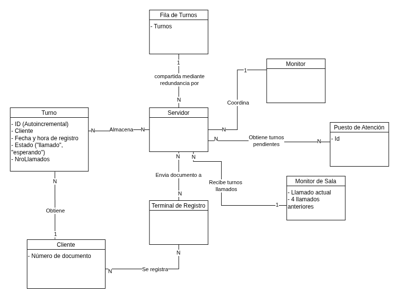
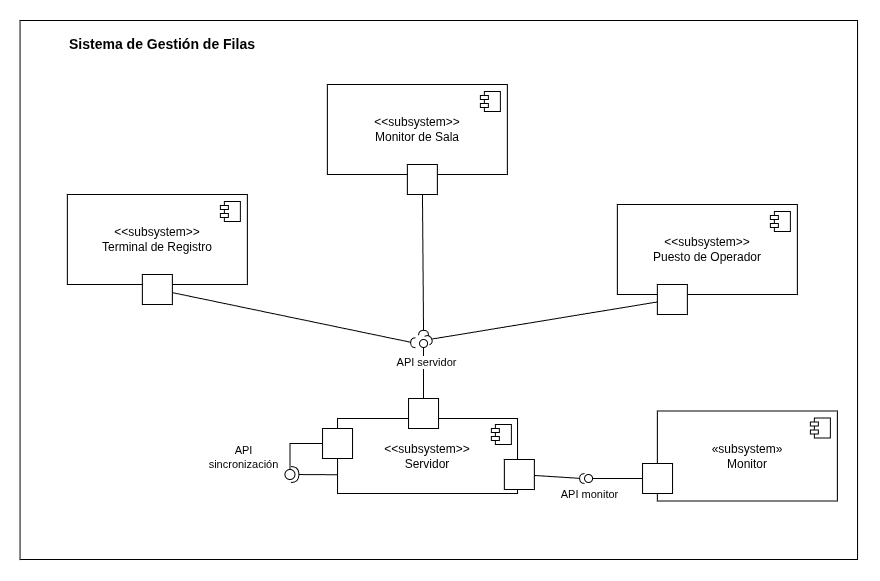
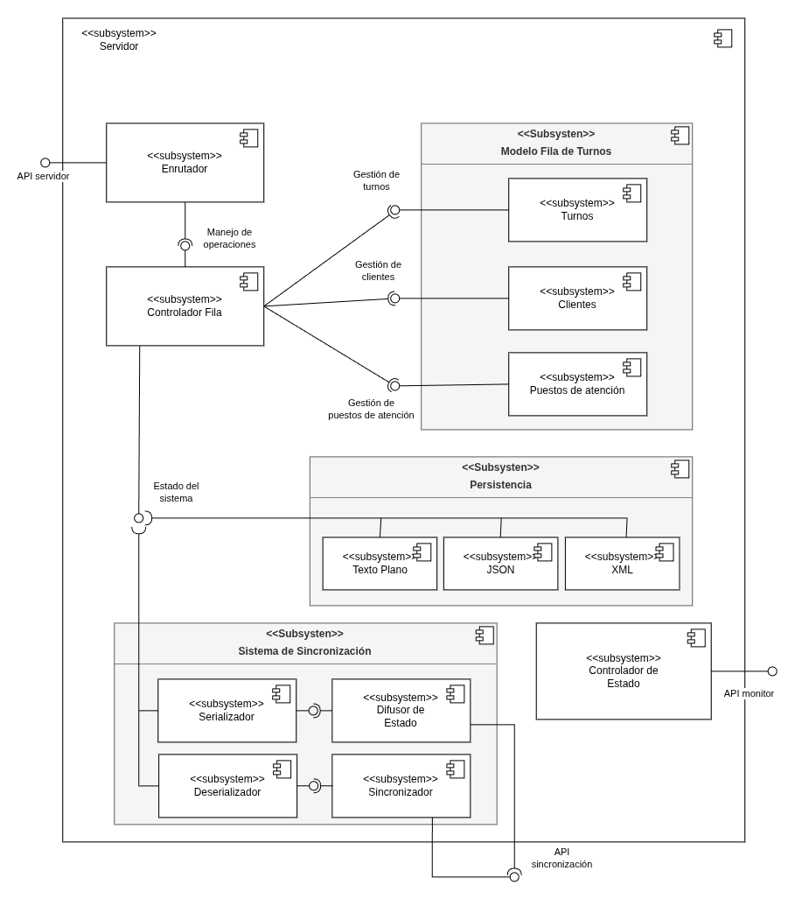
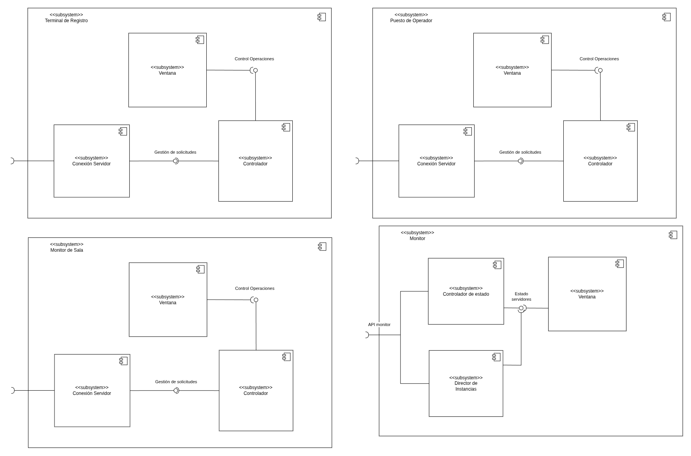
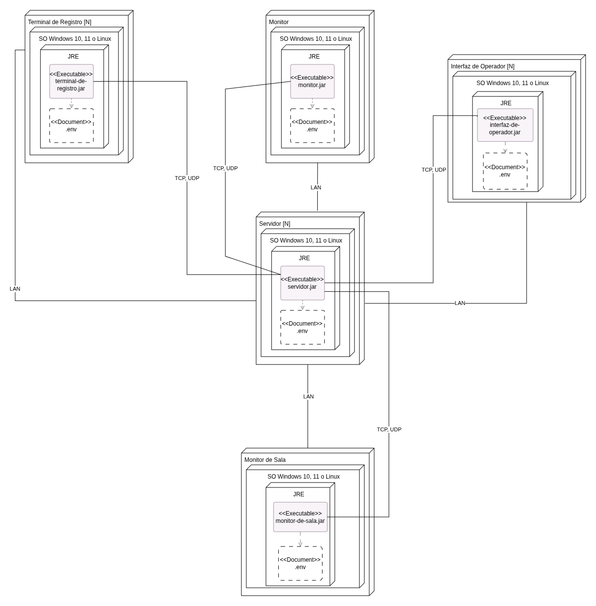
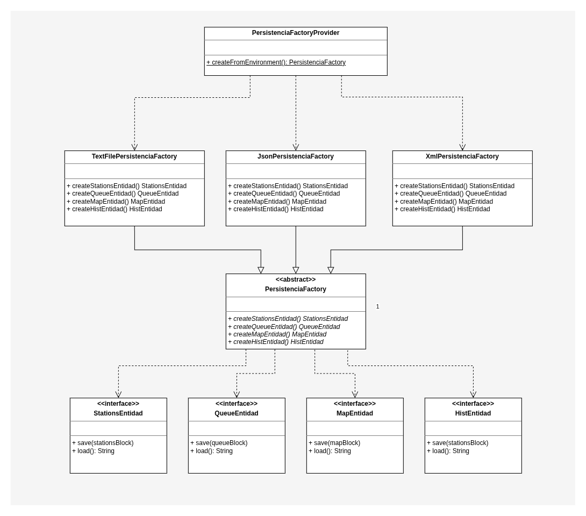
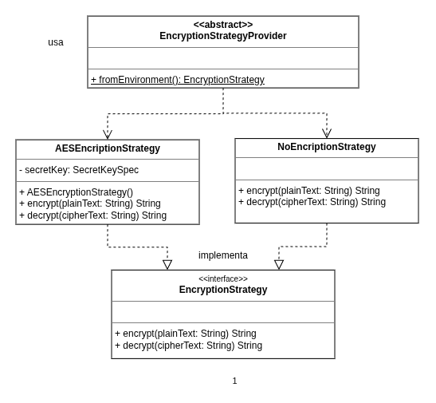
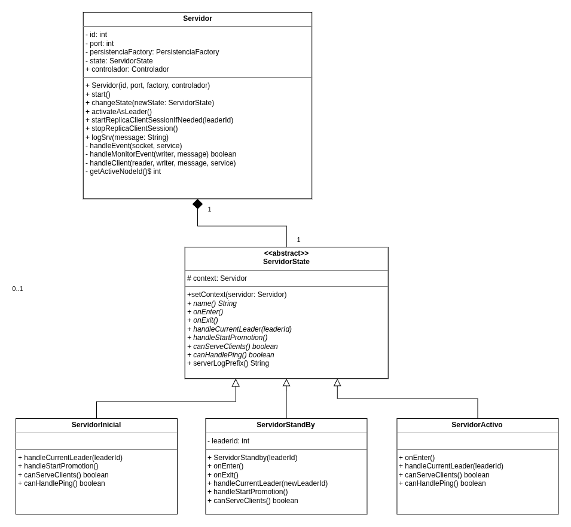
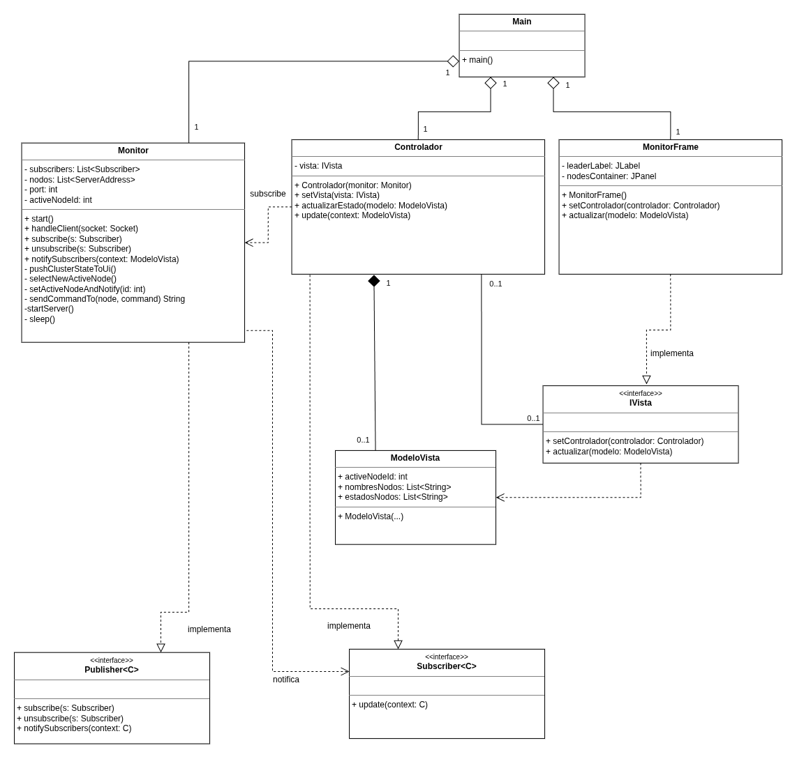

# Sistema de Gestión Digital de Filas

> Proyecto de un sistema distribuido, resiliente y seguro para la orquestación de turnos y atención al cliente en tiempo real. Evolucionó desde el análisis funcional y de dominio hasta una arquitectura tolerante a fallos basada en Sockets TCP personalizados, persistencia configurable y cifrado simétrico.


Este proyecto consiste en una solución integral para la gestión de filas en entornos de atención al público. Diseñado como un ecosistema de aplicaciones de escritorio interconectadas que se comunican a través de un protocolo de red bidireccional en tiempo real (*Push Notifications*), evita el uso de *polling* constante para optimizar el ancho de banda y garantizar baja latencia en terminales, puestos de atención y monitores públicos.

## Proceso de Análisis y Casos de Uso

Antes de definir la infraestructura técnica, se realizó un proceso iterativo de ingeniería de requerimientos y análisis orientado a objetos para estructurar el comportamiento del sistema:

* **Identificación de Actores:** Se delimitaron las responsabilidades del **Cliente** (auto-registro), el **Personal de Atención / Operador** (gestión del llamado y re-notificación) y el **Servidor Central / Sistema** (orquestación y sincronización de estado).
* **Especificación de Casos de Uso Expandidos:** Se modelaron y detallaron los flujos principales y cursos alternativos para los escenarios clave:
  * **CU-001 (Registrar cliente en la fila):** Validaciones locales de formato de DNI e inserción en la cola sin duplicados.
  * **CU-002 (Llamar al próximo cliente):** Desencolado FIFO, asignación a puestos y notificación inmediata a pantallas públicas.
  * **CU-003 (Re-notificar cliente):** Gestión del protocolo de re-llamado con *cooldown* de 30 segundos y límite de 3 intentos antes del descarte por ausencia.
  * **CU-004 (Marcar cliente como atendido):** Liberación del puesto y actualización del estado del turno.
  * **CU-005 (Configurar Puesto de Atención):** Registro e identificación única de puestos en el servidor central.

## 🧠 Modelo de Dominio

El análisis conceptual del problema derivó en un **Modelo de Dominio** que sirvió como piedra angular para el posterior diseño de la arquitectura de software y el esquema de clases:

* **Entidades Principales:**
  * **`Turno`:** Modela la abstracción del turno con atributos de estado (`esperando`, `llamado`, `atendido`), marca de tiempo de registro, contador de re-notificaciones y puesto asignado.
  * **`Cliente`:** Encapsula la identidad del ciudadano (número de documento).
  * **`Fila de Turnos`:** Representa la estructura conceptual FIFO compartida que gestiona la prioridad.
  * **`Puesto de Atención`:** Modela el puesto físico/operativo identificado por un ID único.
  * **`Monitor de Sala`:** Abstracción de la pantalla pública que refleja el turno actual y el historial de los últimos 4 llamados.



Este modelo permitió separar claramente las reglas de negocio (tiempos de espera, límites de re-notificación, unicidad de DNI en cola) de los detalles de implementación tecnológica (red, persistencia y vistas).

## Componentes del sistema

1. **Servidor Central:** Administra la cola en memoria, la persistencia, el enrutamiento de red y la replicación de estado entre nodos.
2. **Terminal de Registro:** Interfaz de auto-atención para el cliente.
3. **Puesto de Operador:** Panel de control de las cajas para llamar, re-notificar o finalizar atenciones.
4. **Monitor de Sala:** Pantalla pública en tiempo real con resaltado visual de re-notificaciones y desplazamiento de historial.
5. **Monitor de Infraestructura:** Componente supervisor de la disponibilidad del clúster de servidores.





## 🏗️ Arquitectura del Sistema

La arquitectura del sistema se estructura en los siguientes pilares técnicos:

### 1. Topología Cliente-Servidor (Comunicación Bidireccional)
El núcleo es un Servidor Central que mantiene el estado de la fila en memoria RAM para un rendimiento de alta velocidad, utilizando Sockets TCP para notificar en tiempo real a los monitores públicos y a las interfaces de operador.



### 2. Alta Disponibilidad (HA) y Failover Automático
Para mitigar el Punto Único de Falla (SPOF), se implementó un esquema de clúster con **Redundancia Pasiva (Warm Standby)**:
* **Monitor de Infraestructura (Orquestador):** Componente independiente que realiza controles de salud (*Health Checks / Ping-Echo*) constantes sobre el nodo activo.
* **Failover Transparente:** En caso de caída del servidor principal, el Monitor promueve el nodo de respaldo a Activo. Las terminales implementan tácticas de **Reintento (Retry)** para reconectarse automáticamente al nuevo servidor activo.

### 3. Persistencia de Estado Configurable
El estado de la cola de espera, el historial de llamados y los puestos registrados se persisten localmente en el servidor para sobrevivir a reinicios o fallas de energía. Mediante una abstracción desacoplada, el formato de almacenamiento es configurable a **JSON, XML o Texto Plano**.

### 4. Seguridad y Cifrado End-to-End
Para proteger la privacidad de los datos sensibles (DNI), la información se encripta en la capa de aplicación antes de ser enviada por la red o guardada en disco mediante un esquema de **cifrado simétrico AES** con clave compartida.


## 🛠️ Patrones de Diseño Aplicados (GoF)

* **Abstract Factory:** Empleado en el módulo de persistencia (`PersistenciaFactory`) para instanciar la familia de formateadores (`JsonPersistenciaFactory`, `XmlPersistenciaFactory`, `TextFilePersistenciaFactory`) sin acoplar la lógica central a un formato de archivo específico.


* **Strategy:** Utilizado para la seguridad (`EncryptionStrategy`). Permite alternar dinámicamente entre el algoritmo real (`AESEncryptionStrategy`) y estrategias sin cifrado (`NoEncryptionStrategy`) para entornos de prueba.


* **State:** Modela los estados del Servidor (`Inicial`, `Standby`, `Activo`), regulando las operaciones habilitadas y la gestión de hilos de red según el rol actual del nodo.

* **Observer (Publisher/Subscriber):** Implementado en las interfaces de usuario y el monitor de infraestructura para desacoplar los eventos de red de la actualización del modelo de vista (*ModeloVista*).



---

# Descripción tecnica
## Componentes

| Módulo | Descripción |
|---|---|
| **monitor** | Coordinador del clúster. Elige el nodo servidor activo y mantiene la alta disponibilidad. |
| **servidor** | Nodos de backend. Persisten la cola de turnos y procesan los comandos de las interfaces. |
| **terminal_de_registro** | Terminal donde los clientes ingresan su DNI para anotarse en la fila. |
| **interfaz_de_operador** | Puesto de atención. Permite llamar al siguiente, re-notificar y finalizar la atención. |
| **monitor_de_sala** | Pantalla pública que muestra los últimos turnos llamados. |

## Requisitos

- **Java JDK 17+** (o superior)
- **Apache Maven 3.6+**

Verificá las versiones instaladas:

```bash
java -version
mvn -version
```

## Configuración

Todas las aplicaciones leen su configuración desde un archivo `.env` en el **directorio de trabajo** desde el cual se ejecutan. Las variables **no** quedan embebidas en el `.jar`; deben estar disponibles en el entorno de ejecución.

### Crear el archivo `.env`

Copiá el ejemplo incluido en el repositorio:

```bash
cp .env.example .env
```

Editá los valores según tu entorno. A continuación se describe cada variable:

| Variable | Descripción | Valor por defecto |
|---|---|---|
| `CANTIDAD_NODOS` | Cantidad de nodos servidor del clúster. Debe coincidir con la cantidad de entradas `SERVER_HOST_X` / `SERVER_PORT_X`. | `3` |
| `SERVER_HOST_X` | Host del nodo servidor con índice `X` (comienza en `0`). | `localhost` |
| `SERVER_PORT_X` | Puerto del nodo servidor con índice `X`. | `0` |
| `MONITOR_HOST` | Host del coordinador de clúster. | `localhost` |
| `MONITOR_PORT` | Puerto del coordinador de clúster. | `3006` |
| `PERSISTENCIA_TIPO` | Backend de persistencia: `TEXT_FILE`, `JSON` o `XML`. | `TEXT_FILE` |
| `PERSISTENCIA_DIR` | Directorio donde se guardan los datos. | `./data/persistencia` |
| `SERVER_SECRET_KEY` | Clave secreta para cifrar los DNI almacenados. | `grupo6-default-secret-key` |
| `ENCRYPTION_METHOD` | Método de cifrado: `AES` o `NONE`. | `AES` |

> **Importante:** si cambiás `CANTIDAD_NODOS`, agregá o quitá las parejas `SERVER_HOST_X` / `SERVER_PORT_X` correspondientes. Los puertos de cada nodo deben ser distintos entre sí.

### Ejemplo de `.env` para desarrollo local

```env
CANTIDAD_NODOS=3

SERVER_HOST_0=127.0.0.1
SERVER_PORT_0=3001

SERVER_HOST_1=127.0.0.1
SERVER_PORT_1=3002

SERVER_HOST_2=127.0.0.1
SERVER_PORT_2=3003

MONITOR_HOST=127.0.0.1
MONITOR_PORT=3000

PERSISTENCIA_TIPO=TEXT_FILE
PERSISTENCIA_DIR=./data/persistencia

SERVER_SECRET_KEY=grupo6-default-secret-key
ENCRYPTION_METHOD=AES
```

## Compilación

Desde la raíz del proyecto, compilá todos los módulos y generá los `.jar` ejecutables:

```bash
mvn install package
```

Los artefactos se generan en el directorio `target/` de cada módulo:

```
monitor/target/monitor-1.0.jar
servidor/target/servidor-1.0.jar
terminal_de_registro/target/terminal_de_registro-1.0.jar
interfaz_de_operador/target/interfaz_de_operador-1.0.jar
monitor_de_sala/target/monitor_de_sala-1.0.jar
```

Para compilar un solo módulo:

```bash
mvn -pl <nombre_modulo> clean package
```

## Ejecución

### Orden de arranque

Para que el sistema funcione correctamente, iniciá los componentes en este orden:

1. **Monitor** (coordinador de clúster)
2. **Servidores** (uno por cada nodo configurado)
3. **Interfaces de usuario** (terminal, operador y/o monitor de sala)

Asegurate de que el archivo `.env` esté en el directorio desde el cual ejecutás cada aplicación. Una forma sencilla es copiarlo a la raíz del proyecto y ejecutar todos los comandos desde ahí.

### 1. Monitor (coordinador)

```bash
java -jar monitor/target/monitor-1.0.jar
```

Este proceso escucha en `MONITOR_PORT` y coordina qué nodo servidor es el líder activo.

### 2. Servidores

Cada instancia de servidor recibe como argumento el **índice del nodo** (comenzando en `0`). Abrí una terminal por cada nodo:

```bash
# Nodo 0
java -jar servidor/target/servidor-1.0.jar 0

# Nodo 1
java -jar servidor/target/servidor-1.0.jar 1

# Nodo 2
java -jar servidor/target/servidor-1.0.jar 2
```

El índice debe corresponder a la entrada `SERVER_HOST_X` / `SERVER_PORT_X` definida en el `.env`.

### 3. Interfaces de usuario

Una vez que el monitor y al menos un servidor están en ejecución, podés iniciar las interfaces:

**Terminal de registro** — los clientes ingresan su DNI:

```bash
java -jar terminal_de_registro/target/terminal_de_registro-1.0.jar
```

**Interfaz de operador** — el operador atiende la fila:

```bash
java -jar interfaz_de_operador/target/interfaz_de_operador-1.0.jar
```

Al abrirse, la interfaz solicita un **ID de puesto** (por ejemplo, `Ventanilla 1`). Ese identificador debe ser único entre todas las instancias de operador en ejecución.

**Monitor de sala** — pantalla pública con los turnos llamados:

```bash
java -jar monitor_de_sala/target/monitor_de_sala-1.0.jar
```

## Uso del sistema

### Flujo típico

1. Un cliente se registra en la **terminal de registro** ingresando su DNI.
2. El DNI se cifra y se agrega a la cola en el servidor activo.
3. Un operador, desde su **interfaz de operador**, presiona **Llamar Siguiente** para atender al próximo turno.
4. El **monitor de sala** muestra el DNI llamado y el puesto de atención.
5. El operador puede **Re-notificar** (volver a anunciar el turno) o **Finalizar Atención** cuando termina.

### Acciones del operador

| Acción | Descripción |
|---|---|
| **Llamar Siguiente** | Saca de la cola al próximo cliente y lo asigna al puesto del operador. |
| **Re-notificar** | Vuelve a anunciar el turno actual en el monitor de sala (con cooldown de 30 segundos). |
| **Finalizar Atención** | Marca la atención como completada y libera al operador para el siguiente turno. |

## Estructura del proyecto

```
.
├── environment/          # Lectura de variables de entorno (.env)
├── shared/               # Utilidades compartidas (pub/sub)
├── conexion_servidor/    # Cliente TCP para comunicarse con los servidores
├── modelo/               # Modelos de dominio (Turno, FilaTurnos, etc.)
├── persistencia/         # Capa de persistencia (TEXT_FILE, JSON, XML)
├── monitor/              # Coordinador de clúster
├── servidor/             # Nodos de backend
├── terminal_de_registro/ # Terminal de registro de clientes
├── interfaz_de_operador/ # Interfaz del operador
├── monitor_de_sala/      # Monitor público de sala
├── .env.example          # Plantilla de configuración
└── pom.xml               # POM raíz (proyecto multi-módulo Maven)
```

## Solución de problemas

| Problema | Posible causa |
|---|---|
| `Error: puesto no asignado` | La interfaz de operador no completó el registro del ID de puesto al iniciar. |
| `Error: el puesto 'X' ya existe` | Otro operador ya registró ese mismo ID de puesto. Elegí uno distinto. |
| `Buscando nodo activo...` sin conectar | El monitor o los servidores no están en ejecución, o los puertos del `.env` no coinciden. |
| No se persisten los datos | Verificá que `PERSISTENCIA_DIR` apunte a un directorio con permisos de escritura. |
| Error al descifrar DNI | `SERVER_SECRET_KEY` o `ENCRYPTION_METHOD` difieren entre las aplicaciones. Todas deben usar la misma configuración. |
